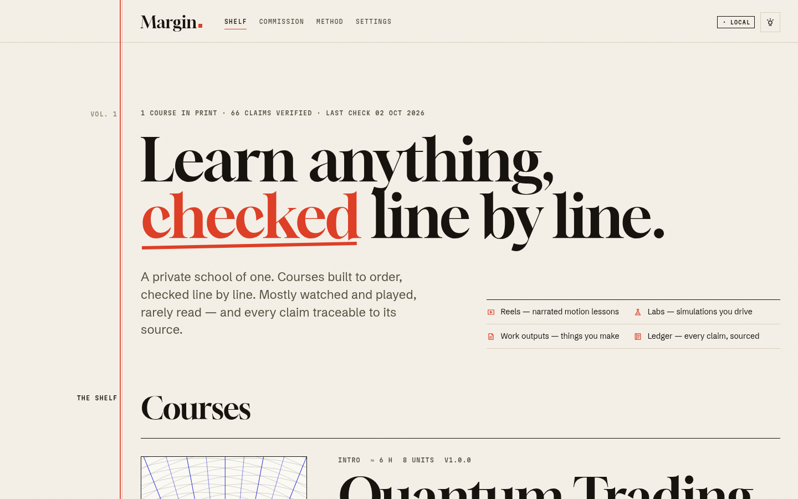
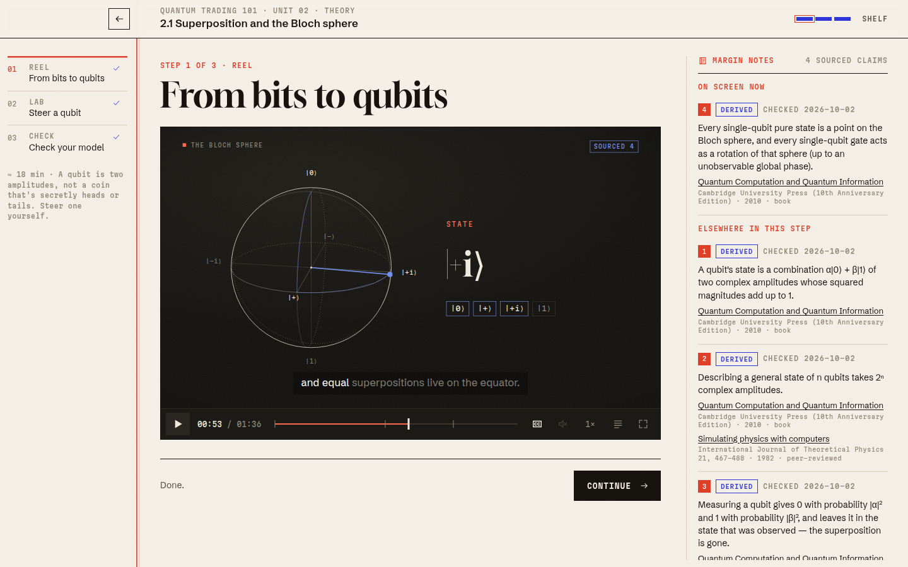
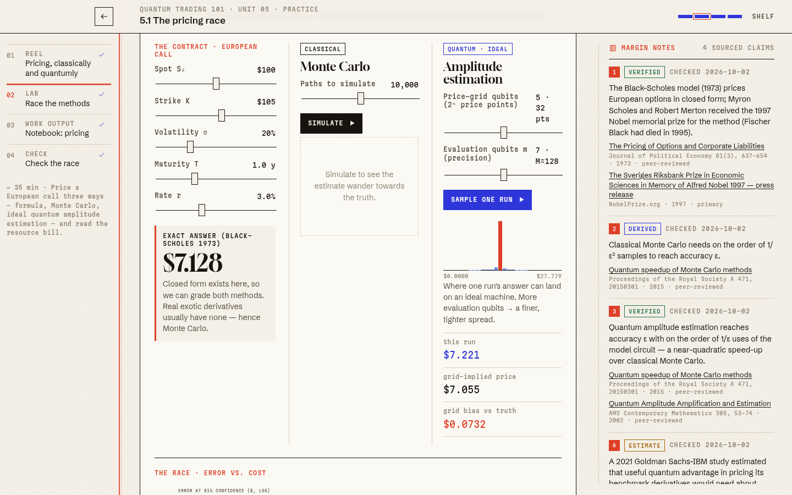
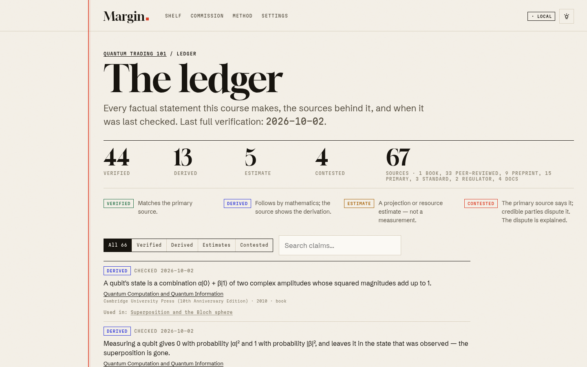

# Margin

**A private school of one.** Courses are built to order by Claude, taught through narrated motion
"reels" and live simulations rather than walls of text, and every factual claim is traceable to a
dated primary source.

The first course on the shelf is **Quantum Trading 101**: the theory you need, working labs for
pricing and portfolios, and an honest, sourced map of the field as of October 2026. You finish by
writing a Quantum Readiness Brief for a trading desk.

| The shelf | A reel, with live margin notes |
|---|---|
|  |  |
| **The pricing lab** | **The claims ledger** |
|  |  |

## What's inside

- **Reels**: a custom video engine that plays JSON-described motion graphics (titles, kinetic
  statements, KaTeX equations, morphing bar charts, line charts, timelines, code that types itself,
  diagrams, plus subject plugins such as Bloch spheres and quantum circuits). It has scrubbing,
  chapters, speed control, a transcript, karaoke-style captions and **narration** through your
  browser's speech voices. The picture waits for the voice, so they never drift apart.
- **Labs** that compute live: an exact statevector simulator (cross-checked against IBM's Qiskit
  to ~10⁻¹⁵), a Bloch-sphere explorer, a circuit builder, Grover's search, a pricing race
  (Black–Scholes vs Monte Carlo vs ideal quantum amplitude estimation), and a portfolio lab
  (Markowitz → QUBO → brute force, simulated annealing, and standard vs constraint-preserving QAOA).
- **Progression**: units unlock in order, steps gate on real completion (watch 85%, meet the lab
  goal, pass the check), and there's a route map, resume points and a lesson-complete stamp.
- **Work outputs**: lab results are saved to a notebook and pulled into deliverables. A capstone
  brief comes together on a "Your work" page you can print to PDF or export as Markdown or JSON.
  A **certificate** with a credential ID is issued on completion.
- **The ledger**: every course ships `sources.json` and `claims.json`. Content cites claims, claims
  cite sources, and the build fails if anything is missing. Margin notes show the evidence for
  whatever is on screen right now.
- **Commission page**: describe what you want to learn next and get a brief to hand to Claude Code.

## Run it locally

Requires Node 20+.

```bash
npm install
npm run dev            # http://localhost:5173
```

That's the whole setup: in local mode, progress, lab results and work outputs live in your
browser's storage. Export or import them under **Settings**.

```bash
npm run build && npm run preview   # production build at http://localhost:4173
```

The build output in `dist/` is a static site. It's a single-page app, so configure your host to
serve `index.html` for unknown paths (Netlify `_redirects`, Vercel rewrites, `try_files` on nginx).

## Run it with Supabase (sync across devices)

Supabase stores only learner data: progress, lab captures, work outputs and certificates. Course
content stays in this repository.

**Hosted Supabase**

1. Create a project at supabase.com.
2. Run the migration: paste `supabase/migrations/20261002000000_margin_init.sql` into the SQL
   editor, or use the CLI: `supabase link --project-ref <ref> && supabase db push`.
3. Under Authentication → URL configuration, add your site URL and `<site>/settings` as redirect
   URLs. Sign-in uses email magic links.
4. Copy `.env.example` to `.env` and fill in `VITE_SUPABASE_URL` and `VITE_SUPABASE_ANON_KEY`
   from Project settings → API.
5. `npm run dev`, open **Settings**, and sign in. Local progress is merged up on first sign-in.

**Local Supabase stack** (needs Docker and the Supabase CLI)

```bash
supabase start          # uses supabase/config.toml; applies migrations
# copy the printed API URL and anon key into .env
npm run dev             # magic-link emails arrive in Inbucket: http://localhost:54324
```

Row-level security means each learner can read and write only their own rows. Certificates are
append-only, and anyone holding a credential ID can verify it through the `verify_certificate`
function. `npm run test:db` checks all of this against a throwaway Postgres; no Docker needed.

## Adding a subject

Open the repo in Claude Code and ask for a course, or paste the brief from the site's
**Commission** page. Claude follows `.claude/skills/add-subject/SKILL.md`:

1. `npm run new:subject -- <id> "Title"` scaffolds `content/courses/<id>/`.
2. Research comes first, building the ledger from primary sources (papers, official releases,
   regulators, standards). News never stands alone; estimates and disputes are labelled.
3. Lessons follow theory → practice → current landscape → capstone, each built from reels,
   labs, checks and deliverables.
4. `npm run validate:strict`, `npm run check-sources`, `npm test` and `npm run test:e2e`, then a
   screenshot pass.

To refresh facts later, ask Claude to re-verify a course (`.claude/skills/reverify-course`).
Strict validation flags any claim not re-checked in 180 days.

Content is plain JSON with generated JSON Schemas (`content/schema/`), so editors autocomplete it.
New kinds of interactive go in `src/plugins/<subject>/` and are registered in
`src/plugins/registry.tsx` and `src/plugins/manifest.ts`.

## How facts are checked

| Check | Where |
|---|---|
| Every citation points to a claim; every claim to a source | `npm run validate` |
| No claim rests only on news; contested claims explain the dispute; preprint-only claims can't be "verified" | `npm run validate` |
| No uncited numbers or dates in narration, quiz explanations or recaps; nothing older than 180 days | `npm run validate:strict` |
| Every source URL answers; arXiv and Crossref titles match what's cited | `npm run check-sources` |
| Lab maths matches known values (Black–Scholes 10.4506, Grover's closed form, Qiskit statevectors) | `npm test` |
| Code shown in reels was run (Qiskit 2.5, D-Wave Ocean) and its output is quoted | course authoring |

The Quantum Trading 101 ledger has 66 claims (44 verified, 13 derived, 5 estimates, 4 contested)
backed by 67 sources, last verified on 2 October 2026. Highlights of what checking changed:
the derivative-pricing threshold uses the published figures (8,000 logical qubits, T-depth 54
million) rather than the preprint's 7.5k. IBM's July 2026 advantage claim is shown next to the
classical rebuttal (37.3 minutes on 256 GPUs). HSBC's 34% bond result carries its authors' own
caveat that hardware noise may be part of the effect.

## Project layout

```
content/courses/        courses (JSON) + _template; content/schema/ generated JSON Schemas
src/content/            zod schema, validator, loader
src/engine/reel/        the reel (video) engine
src/plugins/            plugin manifest/registry; quantum/ = simulator, finance, QUBO/QAOA, labs, shots
src/widgets/ src/steps/ generic interactives and step renderers
src/store/              learner model, local storage, Supabase sync
src/pages/ src/styles/  routes and the design system
supabase/               migrations, config, RLS tests
scripts/                validate, check-sources, new-subject, emit-json-schema, screenshot
tests/unit tests/e2e    Vitest and Playwright
```

## Tests

```bash
npm test            # 40 unit tests: maths, validator rules, progression/sync, strict validation of every course
npm run test:e2e    # Playwright: every page and every step of every lesson renders; full learner flow
npm run test:db     # migrations + row-level security on a throwaway Postgres
npm run typecheck
```

## Credits and licences

Fonts: Gloock, Schibsted Grotesk and Martian Mono (SIL Open Font License), self-hosted via
Fontsource. Maths typesetting: KaTeX (MIT). The optional Quirk embed is Craig Gidney's open-source
simulator, loaded from algassert.com. Third-party material is always labelled as such in the app.
Course content cites its sources; this is a learning tool, not investment advice.
